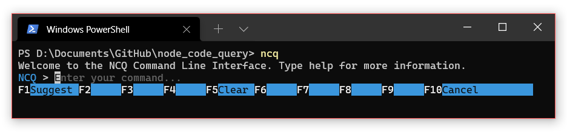
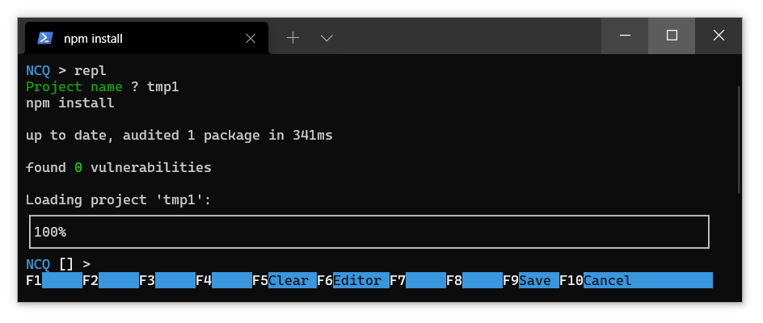
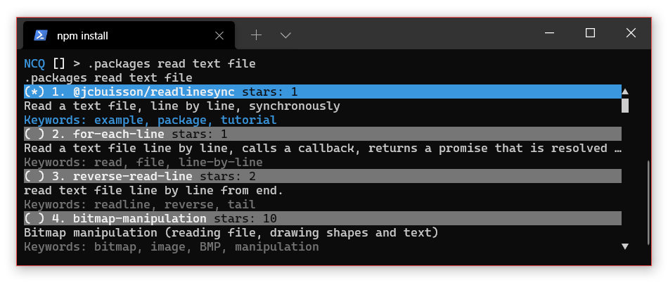
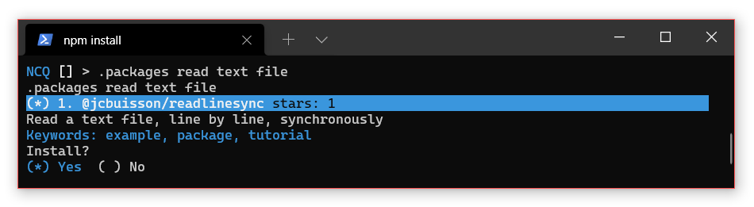
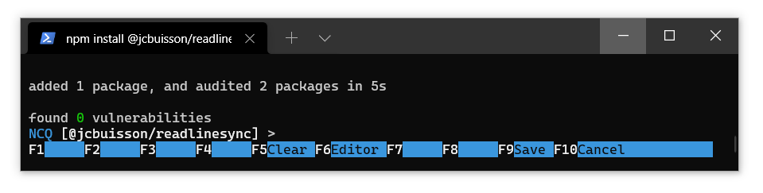
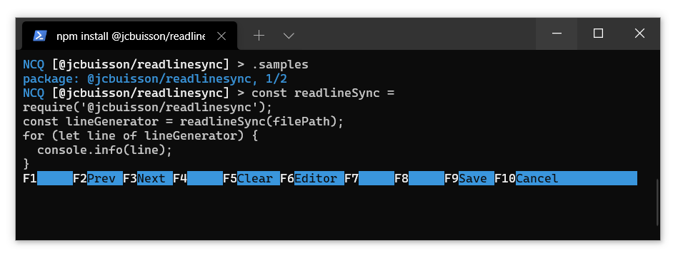

# Node Code Query (NCQ)
<p align="center">
  
</p>

Node Code Query (NCQ) is a tool to help Node.js developers locate, install and try out NPM packages, in a single environment.

NCQ is REPL (Read-Print-Eval Loop) environment that enables users to search for NPM packages and API code snippets. The REPL environment then allows for users to install these packages and begin programming with them. The combination of search and programming environment is what makes NCQ distinct.

## Installation

<details>

### 1. Install Node.js and NPM

NCQ is a research project and may not be compatible with all Node.js versions. The last tested Node.js version was v14.17.0.

*Hint: Use nvm to install node/npm. Install [nvm](https://github.com/nvm-sh/nvm). Then, run the command `nvm install <version>`*

### 2. Clone this repository

```sh
git clone https://github.com/damorimRG/node_code_query.git
```

### 3. Change to the corresponding directory.


```sh
cd node_code_query
```

### 4. Install

```sh
npm install
```

This step may take some time. In addition to installing dependencies, it runs a setup script and downloads a snapshot of the NPM data to create a local database (for efficiency).

You can now use `npm start` to run the program.

### 5. Globally install the `ncq` command (optional).

To use the `ncq` command, and to run ncq from any location, you can install this repository globally.

```sh
npm install -g
```
  
</details>

## Dataset

The dataset will automatically be downloaded when installing NCQ, you do not need to manually download and extract it, however, the dataset is also made available at https://zenodo.org/record/5094598

## Keybindings


### REPL mode

<details>

| KeyBinding | Command | Details |
| - | - | - |
| <kbd>return</kbd> | Submit |  |
| <kbd>escape</kbd> or <kbd>f10</kbd>| Cancel |  |
| <kbd>delete</kbd> | Delete Character | |
| <kbd>meta</kbd> + <kbd>delete</kbd> | Delete word | <kbd>ctrl</kbd> + <kbd>w</kbd> also works. |
| <kbd>ctrl</kbd> + <kbd>delete</kbd> | Delete line | <kbd>ctrl</kbd> + <kbd>u</kbd> also works. |
| <kbd>ctrl</kbd> + <kbd>←</kbd> | Move to line start | |
| <kbd>ctrl</kbd> + <kbd>➞</kbd> | Move to line end | |
| <kbd>meta</kbd> + <kbd>←</kbd> | Previous Word | <kbd>meta</kbd> + <kbd>b</kbd> also works. |
| <kbd>meta</kbd> + <kbd>➞</kbd> | Next word | <kbd>meta</kbd> + <kbd>f</kbd> also works. |
| <kbd>↑</kbd> | Cursor Line Up | |
| <kbd>↓</kbd> | Cursor Line Down | |
| <kbd>f4</kbd> | Newline | |
| <kbd>f5</kbd> | Clear | Clears currently entered input, not the same as `.clear`. |
| <kbd>f6</kbd> | Editor | Enter editor mode. |
| <kbd>f9</kbd> | Save | |

</details>

### Editor mode

<details>

| KeyBinding | Command | Details |
| - | - | - |
| <kbd>return</kbd> | Newline |  |
| <kbd>f9</kbd> or <kbd>ctrl</kbd> + <kbd>s</kbd>| Save |  |

</details>

## Example

Let us consider the scenario where the developer wants to read a file (e.g., "/etc/passwd") and print its contents on screen. Here is how NCQ can help:

### 1. Start NCQ

(Brittany: The images are placeholders, they take up too much room at the moment.)

Run the `ncq` command, or if you didn't install the tool globally, `npm start` within the root drectory. Your screen should look like this.

<p align="center">
  
</p>

### 2. Create a new REPL
Type the `repl` command to create an environment where you can play with different examples. The name REPL refers to "Read Eval Print Loop". The tool will present the REPL load menu, if this is the first use, you will be prompted to name a new REPL project instead. When you are done, the REPL will start, initializing your project and loading in the code snippet database. This may take some time.

<p align="center">
  
</p>

The square brackets in the command prompt indicate that you successfully created a node repl, i.e., you can run any node.js code from the prompt now. However, you do not have any library installed!

### 3. Search for packages

Type `.packages read text file` to see an interactive list of packages from NPM you can install.

<p align="center">
  
</p>

In this case, we select the first package using enter. This will ask us if we would like to install. Press enter to install the package.

<p align="center">
  
</p>

Your screen should now look like this, indicating the package was installed successfully:

<p align="center">
  
</p>

### 4. Search for code snippets

Use the `.samples` command to see code snippets for the currently installed packages. You can also search for the specific package using `.samples @jcbuisson/readlinesync`. You should see a code snippet on your screen, you can navigate these with `F2` and `F3`.

<p align="center">
  
</p>

### 5. Run the example

The above example generates an iteratable set of lines from a file, then prints each line. Press enter to run the code. You will see an error that `filePath` is undefined.

(Brittany: I also notice the package/snippet header doesn't clear properly, I will look into this. EDIT: should be fixed now)

### 6. Modify the example

Rerun the `.samples` command to see the previous example. This time, add a new line at the beginning. Remember that the current working directory is the REPL project directory, so you need the file to be in this directory for the following path to work:

```js
var filePath = "etc/passwd" //new code
const readlineSync = require('@jcbuisson/readlinesync');
const lineGenerator = readlineSync(filePath);
for (let line of lineGenerator) {
  console.info(line);
}
```

If you recieve an error about already defined constants, use the `.clear` command to reset your REPL state.

(Brittany: I need to re-add the newline button, sorry I forgot! Just copy the whole example code. EDIT: should work now.)

You will see the contents of the file outputed on the REPL.

(Brittany: you will also see some `undefineds` this is a repl option that can be disabled, I thought seeing undefined may be good, but it does this for each line so I will disable it again soon.)

### 7. Save the project

Use the `.save index.js` command to save your progress. This file can be found in the `repls/PROJECT` directory.


## Usage
  
You can start the NCQ CLI by using the ncq command anywhere.
  
```sh
ncq [options]
```
  
If you didn't install NCQ globally, you can use `npm start` to run the program in the repository directory.
<details><summary>Options</summary>
    
|option|description|
|-|-|
|-d, --debug|Run in debug mode, enables extra logging. |
|-u, --usage|Enable additional logging for user study purposes. |
|-r, --recordLimit \<num\>|Limit the number of packages loaded. | 
    
</details>
  
### Load a REPL
  
To load or create a new REPL, use the `repl` command. Once you have selected an option, NCQ will load that instance for you and you can begin programming!

### REPL Commands
  
<details>
  
#### `.packages <query>`
  
Search for packages using the given query string, now interactively! If you select a package, you can now install it from ths menu.
 
#### `.install [packages]`
  
Given a package or list of packages, installs these in your REPL project.
  
#### `.uninstall [packages]`
  
Uninstalls a given package.
  
#### `.samples [packages]`
  
Searches for code snippets from the given packages, and shows them to you right in your REPL prompt.
  
#### `.help`
  
Show more commands.
    
</details>
  
### References
  
Links to published work will be added here.

